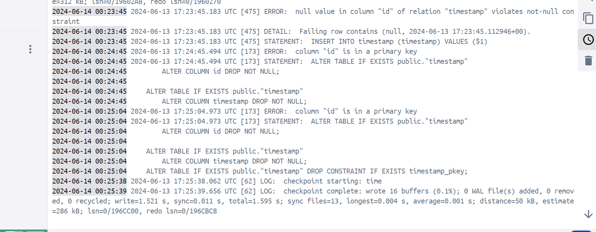

1. Prepare single database, single table, and single column, for timestamp

2. Create golang project, and add route "/ping" if can connect to database, output to browser is Pong! and console is Ping Successful, if failed, Ouch and console is Ping Failed. And can show timestamp if connected.

3. Created docker-compose.yml for run 2 container, set container name, network name, also volume name

4. Create docker compose and can see on docker desktop 

5. Run localhost:4331 and show word that have been created 

6. Run localhost:4331/ping and show pong for success and new data timestamp inserted in database

7. Check log from each container

