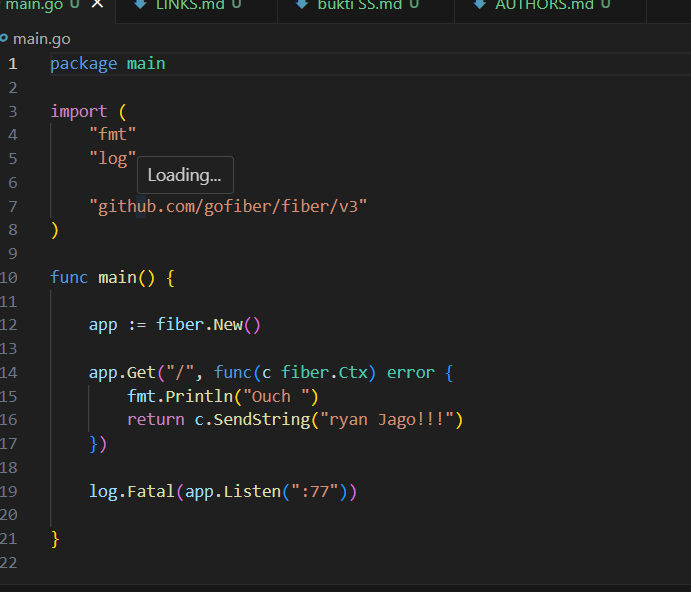
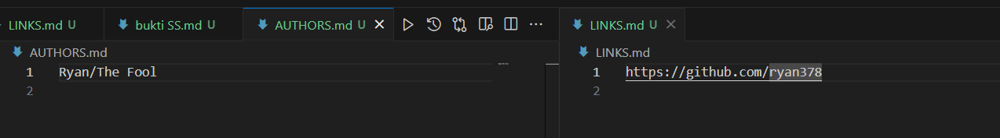
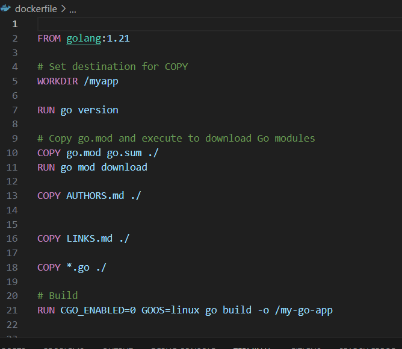
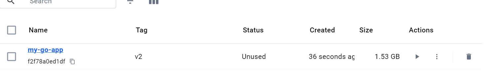
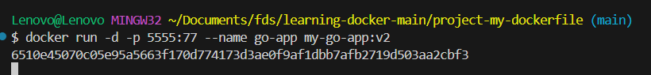
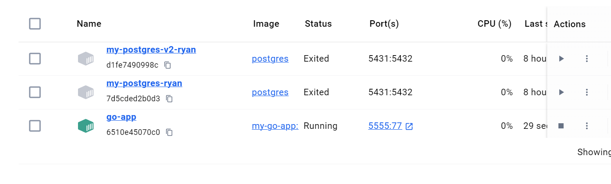
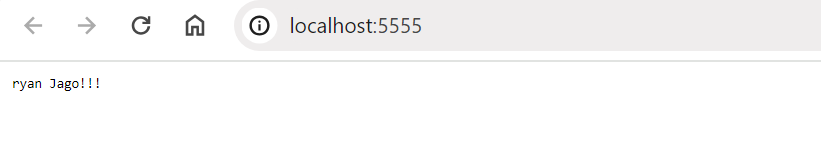
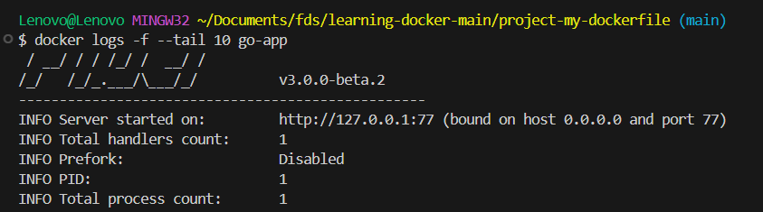

1. Create golang project, path "/" to print html text and in console, also setting port on 77 1  Create new golang project, print html text, and start http port on 77

2. Create file AUTHORS.md and LINKS.md

3. Create dockerfile

4. Build Dockerfile image with name my-go-app-v2

5. Dockerimage that has been build can be see in Image Tab on Docker Desktop image

6. Run the dockerimage into container image

7. Container that has been build with the image, can be seen on Container Tab in Docker Desktop image

8. Access the golang inside docker via localhost:5555 image

9. See logs of the container image

